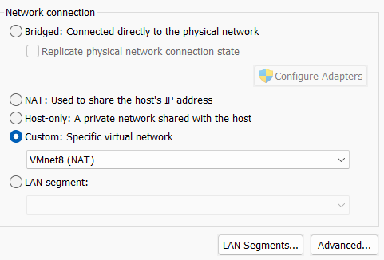

# Network Encountered Issue

## Problem

Initial inter-VM communication failed.

## Root Cause

VMs were deployed across mismatched virtual networks.

## Resolution

Unified all VMs under identical internal adapter configuration.

## Evidence

## Lesson Learned

Virtual topology matters as much as system configuration.
