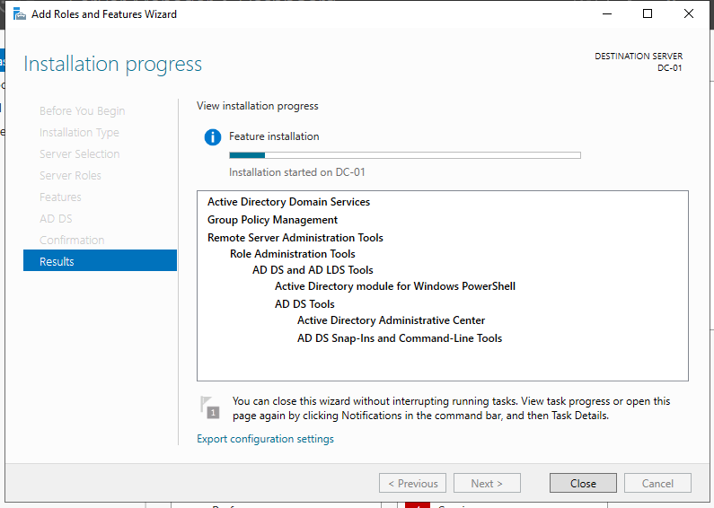

# Active Directory Domain Services Installation

## Objective

Prepare the Windows Server system to function as an enterprise authentication and directory service host by installing the Active Directory Domain Services (AD DS) role.

At this stage, the server is still operating as a standard Windows Server instance.  
No identity, authentication, or directory functionality exists until this role is installed.

## Installation Process

The AD DS role was installed using Server Manager in a role-based configuration model.  
Only the required components for domain services were selected to avoid unnecessary additional services being introduced to the system.

The following components were applied:

- Active Directory Domain Services  
- Required management tools  
- Supporting system services  

No optional or unrelated server roles were installed during this phase.

## Why This Matters

The AD DS role transforms a generic Windows Server into the control authority of the network.

This installation introduces:

- Kerberos authentication provider  
- LDAP directory engine  
- SYSVOL replication services  
- Domain controller capability  
- Policy management support  

Once installed, the system can host:

- User accounts  
- Groups  
- Trust relationships  
- Password policies  
- Authentication services  

This is the foundation of any enterprise identity infrastructure.

## Evidence

## Observations

The installation completed without errors, warnings, or missing dependencies.  
No reboots were required prior to domain promotion.

Event logs confirmed successful service initialization.

---

## Security Considerations

Installing unnecessary server roles alongside AD DS increases attack surface.

Roles such as web servers, database servers, or file servers should not coexist with Domain Controllers unless explicitly required.

Keeping the system dedicated to identity processing:

- Simplifies auditing  
- Minimizes lateral movement risk  
- Reduces exploit avenues  
- Improves incident response clarity  

---

## Risk Rating

Medium (due to privilege escalation impact if compromised)

---

## Recommendation

Organizations should:

- Deploy AD DS only on dedicated hosts  
- Limit administrative access to the server  
- Harden baseline configuration before forest creation  
- Monitor Directory Services logs continuously  
